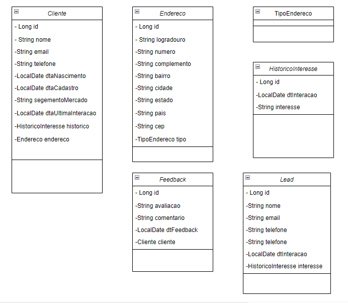
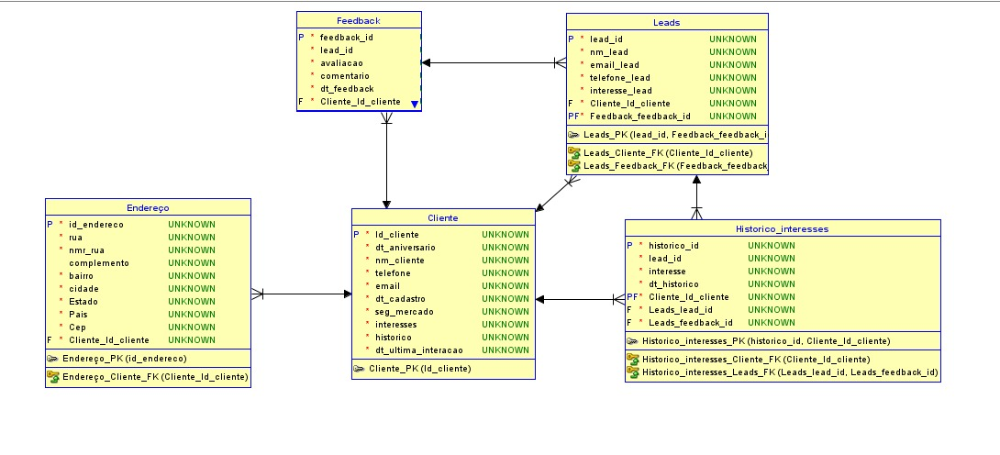

# AI Connect Solutions
API do projeto AIConnectSolutions - Sistema de Relacionamento de Clientes

---

## Integrantes
Ana Clara Rocha de Oliveira: Java<br>
Thiemi Hiratani Favaro: Mobile<br>
Stephany Siqueira: C#.Net<br>
Camila dos Santos Cunha: Devops<br>
Guilherme Castro: Banco de Dados

---
Documentação swagger disponível em localhost:8080/docs
---

## Diagramas


---

## Vídeo de Apresentação

https://www.youtube.com/watch?v=jBEfc79HPe0

## Documentação da API

### Endpoint
- [Listar Todos os Clientes](#listar-todos-os-clientes)
- [Cadastrar Cliente](#cadastrar-cliente)
- [Detalhes do Cliente](#detalhes-do-cliente)
- [Atualizar dados do Cliente](#detalhes-do-cliente)
- [Deletar dados do Cliente](#detalhes-do-cliente)

- [Listar Todos os Endereços](#listar-todos-os-endereços)
- [Cadastrar Endereço](#cadastrar-endereço)
- [Detalhes do Endereço](#detalhes-do-endereço)
- [Atualizar dados do Endereço](#detalhes-do-endereço)
- [Deletar dados do Endereço](#detalhes-do-endereço)

- [Listar Todos os Feedbacks](#listar-todos-os-feedbacks)
- [Cadastrar Feedback](#cadastrar-feedback)
- [Detalhes do Feedback](#detalhes-do-feedback)
- [Atualizar dados do Feedback](#detalhes-do-feedback)
- [Deletar dados do Feedback](#detalhes-do-feedback)

- [Listar Todos os Interesses](#listar-todos-os-interesses)
- [Cadastrar Interesse](#cadastrar-interesse)
- [Detalhes do Interesse](#detalhes-do-interesse)
- [Atualizar dados do Interesse](#detalhes-do-interesse)
- [Deletar dados do Interesse](#detalhes-do-interesse)

- [Listar Todas as Leads](#listar-todos-as-leads)
- [Cadastrar Lead](#cadastrar-lead)
- [Detalhes da Lead](#detalhes-da-lead)
- [Atualizar dados da Lead](#detalhes-da-lead)
- [Deletar dados da Lead](#detalhes-da-lead)


### Listar Todos os Clientes

`GET` /cliente

Retorna todos os clientes cadastrados.

#### Exemplo de Resposta

```js
[
  {
    "id": 0,
    "nome": "string",
    "email": "string",
    "telefone": "string",
    "dtaNascimento": "2024-05-20",
    "dtaCadastro": "2024-05-20",
    "segmentoMercado": "string",
    "dtaUltimaInteracao": "2024-05-20",
    "endereco": {
      "id": 0,
      "logradouro": "string",
      "numero": "string",
      "complemento": "string",
      "bairro": "string",
      "cidade": "string",
      "estado": "string",
      "pais": "string",
      "cep": "string",
      "tipo": "string"
    },
    "interesse": {
      "id": 0,
      "interesse": "string",
      "dtInteração": "2024-05-20"
    }
  }
]
```

#### Códigos de Status

|código|descrição|
|------|---------|
|200|A lista de clientes foi retornada com sucesso!
|401|Acesso não permitido. É necessário autentificação.

---

### Cadastrar Cliente 

`POST` /cliente

Cria um novo cliente utilizando as informações enviadas no corpo da requisição.

#### Corpo da Requisição

|campo|tipo|obrigatório|descrição|
|-----|----|:-----------:|---------|
|nome|string|✅| Nome do cliente.
|email|string|✅|Email do cliente.
|telefone|string|✅|Telefone do cliente.
|dtaNascimento|localDate|✅|Data de nascimento do cliente.
|dtaCadastro|localDate|✅|Data de cadastro do cliente.
|segmentoMercado|string|✅|Segmento de mercado do cliente.
|dtaUltimaInteracao|localDate|✅|Data da ultima interação do cliente.
|endereço|object|❌|Endereço relacionado ao cliente.
|interesse|object|❌|Interesse relacionado ao cliente.


```js
{
  "nome": "string",
  "email": "string",
  "telefone": "string",
  "dtaNascimento": "2024-05-20",
  "dtaCadastro": "2024-05-20",
  "segmentoMercado": "string",
  "dtaUltimaInteracao": "2024-05-20",
  "endereco": {
    "id": 0,
    "logradouro": "string",
    "numero": "string",
    "complemento": "string",
    "bairro": "string",
    "cidade": "string",
    "estado": "string",
    "pais": "string",
    "cep": "string",
    "tipo": "string"
  },
  "interesse": {
    "id": 0,
    "interesse": "string",
    "dtInteração": "2024-05-20"
  }
}
```

#### Exemplo de Resposta

```js
{
  "id": 0,
  "nome": "string",
  "email": "string",
  "telefone": "string",
  "dtaNascimento": "2024-05-20",
  "dtaCadastro": "2024-05-20",
  "segmentoMercado": "string",
  "dtaUltimaInteracao": "2024-05-20",
  "endereco": {
    "id": 0,
    "logradouro": "string",
    "numero": "string",
    "complemento": "string",
    "bairro": "string",
    "cidade": "string",
    "estado": "string",
    "pais": "string",
    "cep": "string",
    "tipo": "string"
  },
  "interesse": {
    "id": 0,
    "interesse": "string",
    "dtInteração": "2024-05-20"
  }
}
```

#### Códigos de Status

|código|descrição|
|------|---------|
|201|Cliente adicionado com sucesso!
|400|Não foi possível adicionar o cliente. Verifique o corpo da requisição
|401|Acesso não permitido. É necessário autentificação.
---

### Detalhes do Cliente

`GET` /cliente/`{id}`

Retorna um cliente específico pelo ID. Parâmetros de entrada:
ID do cliente.

#### Exemplo de Resposta

```js
// requisição para /cliente/0
{
  "id": 0,
  "nome": "string",
  "email": "string",
  "telefone": "string",
  "dtaNascimento": "2024-05-20",
  "dtaCadastro": "2024-05-20",
  "segmentoMercado": "string",
  "dtaUltimaInteracao": "2024-05-20",
  "endereco": {
    "id": 0,
    "logradouro": "string",
    "numero": "string",
    "complemento": "string",
    "bairro": "string",
    "cidade": "string",
    "estado": "string",
    "pais": "string",
    "cep": "string",
    "tipo": "string"
  },
  "interesse": {
    "id": 0,
    "interesse": "string",
    "dtInteração": "2024-05-20"
  }
}
```

#### Códigos de Status

|código|descrição|   
|------|---------|
|200|Os dados do cliente foram retornados com sucesso!
|401|Acesso não permitido. É necessário autentificação.
|404|Não existe dados do cliente com o `id` informado.

---
### Atualizar dados do Cliente

`PUT` /cliente/`{id}`

Altera os dados do cliente especificado pelo id, utilizando as informações enviadas no corpo da requisição


#### Corpo da Requisição

|campo|tipo|obrigatório|descrição|
|-----|----|:-----------:|---------|
|nome|string|✅| Nome do cliente.
|email|string|✅|Email do cliente.
|telefone|string|✅|Telefone do cliente.
|dtaNascimento|localDate|✅|Data de nascimento do cliente.
|dtaCadastro|localDate|✅|Data de cadastro do cliente.
|segmentoMercado|string|✅|Segmento de mercado do cliente.
|dtaUltimaInteracao|localDate|✅|Data da ultima interação do cliente.
|endereço|object|❌|Endereço relacionado ao cliente.
|interesse|object|❌|Interesse relacionado ao cliente.


```js
// requisição para /cliente/0
{
  "nome": "string",
  "email": "string",
  "telefone": "string",
  "dtaNascimento": "2024-05-20",
  "dtaCadastro": "2024-05-20",
  "segmentoMercado": "string",
  "dtaUltimaInteracao": "2024-05-20",
  "endereco": {
    "id": 0,
    "logradouro": "string",
    "numero": "string",
    "complemento": "string",
    "bairro": "string",
    "cidade": "string",
    "estado": "string",
    "pais": "string",
    "cep": "string",
    "tipo": "string"
  },
  "interesse": {
    "id": 0,
    "interesse": "string",
    "dtInteração": "2024-05-20"
  }
}
```

#### Exemplo de Resposta

```js
// requisição para /cliente/0
{
  "id": 0,
  "nome": "string",
  "email": "string",
  "telefone": "string",
  "dtaNascimento": "2024-05-20",
  "dtaCadastro": "2024-05-20",
  "segmentoMercado": "string",
  "dtaUltimaInteracao": "2024-05-20",
  "endereco": {
    "id": 0,
    "logradouro": "string",
    "numero": "string",
    "complemento": "string",
    "bairro": "string",
    "cidade": "string",
    "estado": "string",
    "pais": "string",
    "cep": "string",
    "tipo": "string"
  },
  "interesse": {
    "id": 0,
    "interesse": "string",
    "dtInteração": "2024-05-20"
  }
}
```

#### Códigos de Status

|código|descrição|   
|------|---------|
|200|Cliente atualizado com sucesso!
|401|Acesso não permitido. É necessário autentificação.
|400|Dados enviados são inválidos. Verifique o corpo da requisição.

---
### Deletar dados do Cliente

`DELETE` /cliente/`{id}`

Apaga os dados um cliente específico pelo ID. Parâmetros de entrada:
ID do cliente.


#### Códigos de Status

|código|descrição|   
|------|---------|
|201|Dados do cliente foram apagados com sucesso!
|401|Acesso não permitido. É necessário autentificação.
|404|Não existe dados do cliente com o `id` informado.

---

___
### Listar Todos os Endereços

`GET` /endereco

Retorna todos os endereços cadastrados.

#### Exemplo de Resposta

```js
[
  {
    "id": 0,
    "logradouro": "string",
    "numero": "string",
    "complemento": "string",
    "bairro": "string",
    "cidade": "string",
    "estado": "string",
    "pais": "string",
    "cep": "string",
    "tipo": "string"
  }
]
```

#### Códigos de Status

|código|descrição|
|------|---------|
|200|A lista de endereços foi retornada com sucesso!
|401|Acesso não permitido. É necessário autentificação.

---

### Cadastrar Endereço 

`POST` /endereco

Cria um novo endereço utilizando as informações enviadas no corpo da requisição.

#### Corpo da Requisição

|campo|tipo|obrigatório|descrição|
|-----|----|:-----------:|---------|
|logradouro|string|✅| Logradouro do endereço.
|numero|string|✅|Número do endereço.
|complemento|string|❌|Complemento do endereço.
|bairro|string|✅|Bairro do endereço.
|cidade|string|✅|Cidade do endereço.
|estado|string|✅|Estado do endereço.
|pais|string|✅|País do endereço.
|cep|string|✅|CEP do endereço.
|tipo|string|✅|Tipo do endereço.


```js
{
  "logradouro": "string",
  "numero": "string",
  "complemento": "string",
  "bairro": "string",
  "cidade": "string",
  "estado": "string",
  "pais": "string",
  "cep": "string",
  "tipo": "string"
}
```

#### Exemplo de Resposta

```js
{
  "id": 0,
  "logradouro": "string",
  "numero": "string",
  "complemento": "string",
  "bairro": "string",
  "cidade": "string",
  "estado": "string",
  "pais": "string",
  "cep": "string",
  "tipo": "string"
}
```

#### Códigos de Status

|código|descrição|
|------|---------|
|201|Endereço adicionado com sucesso!
|400|Não foi possível adicionar o endereço. Verifique o corpo da requisição
|401|Acesso não permitido. É necessário autentificação.
---

### Detalhes do Endereço

`GET` /endereço/`{id}`

Retorna um endereço específico pelo ID. Parâmetros de entrada:
ID do endereço.

#### Exemplo de Resposta

```js
// requisição para /endereco/0
{
  "id": 0,
  "logradouro": "string",
  "numero": "string",
  "complemento": "string",
  "bairro": "string",
  "cidade": "string",
  "estado": "string",
  "pais": "string",
  "cep": "string",
  "tipo": "string"
}
```

#### Códigos de Status

|código|descrição|   
|------|---------|
|200|Os dados do endereço foram retornados com sucesso!
|401|Acesso não permitido. É necessário autentificação.
|404|Não existe dados do endereço com o `id` informado.

---
### Atualizar dados do Endereço

`PUT` /endereco/`{id}`

Altera os dados do endereço especificado pelo id, utilizando as informações enviadas no corpo da requisição.


#### Corpo da Requisição

|campo|tipo|obrigatório|descrição|
|-----|----|:-----------:|---------|
|logradouro|string|✅| Logradouro do endereço.
|numero|string|✅|Número do endereço.
|complemento|string|❌|Complemento do endereço.
|bairro|string|✅|Bairro do endereço.
|cidade|string|✅|Cidade do endereço.
|estado|string|✅|Estado do endereço.
|pais|string|✅|País do endereço.
|cep|string|✅|CEP do endereço.
|tipo|string|✅|Tipo do endereço.


```js
// requisição para /endereco/0
{
  "logradouro": "string",
  "numero": "string",
  "complemento": "string",
  "bairro": "string",
  "cidade": "string",
  "estado": "string",
  "pais": "string",
  "cep": "string",
  "tipo": "string"
}
```

#### Exemplo de Resposta

```js
// resposta para a requisição de atualização para /endereco/0
{
  "id": 0,
  "logradouro": "string",
  "numero": "string",
  "complemento": "string",
  "bairro": "string",
  "cidade": "string",
  "estado": "string",
  "pais": "string",
  "cep": "string",
  "tipo": "string"
}
```

#### Códigos de Status

|código|descrição|   
|------|---------|
|200|Endereço atualizado com sucesso!
|401|Acesso não permitido. É necessário autentificação.
|400|Dados enviados são inválidos. Verifique o corpo da requisição.

---
### Deletar dados do Endereço

`DELETE` /endereco/`{id}`

Apaga os dados de um endereço específico pelo ID. Parâmetros de entrada:
ID do endereço.


#### Códigos de Status

|código|descrição|   
|------|---------|
|201|Dados do endereço foram apagados com sucesso!
|401|Acesso não permitido. É necessário autentificação.
|404|Não existe dados do endereço com o `id` informado.

---
## Listar Todos os Feedbacks

`GET` /feedback

Retorna todos os feedbacks cadastrados.

### Exemplo de Resposta

```json
[
  {
    "id": 0,
    "avaliacao": "string",
    "comentario": "string",
    "dtFeedBack": "2024-05-20",
    "cliente": {
      "id": 0,
      "nome": "string",
      "email": "string",
      "telefone": "stringstri",
      "dtaNascimento": "2024-05-20",
      "dtaCadastro": "2024-05-20",
      "segmentoMercado": "string",
      "dtaUltimaInteracao": "2024-05-20",
      "endereco": {
        "id": 0,
        "logradouro": "string",
        "numero": "string",
        "complemento": "string",
        "bairro": "string",
        "cidade": "string",
        "estado": "string",
        "pais": "string",
        "cep": "string",
        "tipo": "string"
      },
      "interesse": {
        "id": 0,
        "interesse": "string",
        "dtInteração": "2024-05-20"
      }
    }
  }
]
```

#### Códigos de Status

|código|descrição|
|------|---------|
| 200 | A lista de feedbacks foi retornada com sucesso! 
| 401 | Acesso não permitido. É necessário autentificação.

---

## Cadastrar Feedback

`POST` /feedback

Cria um novo feedback utilizando as informações enviadas no corpo da requisição.

#### Corpo da Requisição

|campo|tipo|obrigatório|descrição|
|-----|----|:-----------:|---------|
| avaliacao| string |✅ | Avaliação do feedback.   
| comentario| string |✅| Comentário do feedback.  
| dtFeedBack| date   |✅| Data do feedback.        
| cliente| object |✅| Cliente relacionado ao feedback.  


```js
{
  "avaliacao": "string",
  "comentario": "string",
  "dtFeedBack": "2024-05-20",
  "cliente": {
    "id": 0,
    "nome": "string",
    "email": "string",
    "telefone": "stringstri",
    "dtaNascimento": "2024-05-20",
    "dtaCadastro": "2024-05-20",
    "segmentoMercado": "string",
    "dtaUltimaInteracao": "2024-05-20",
    "endereco": {
      "id": 0,
      "logradouro": "string",
      "numero": "string",
      "complemento": "string",
      "bairro": "string",
      "cidade": "string",
      "estado": "string",
      "pais": "string",
      "cep": "string",
      "tipo": "string"
    },
    "interesse": {
      "id": 0,
      "interesse": "string",
      "dtInteração": "2024-05-20"
    }
  }
}
```

#### Exemplo de Resposta

```js
{
  "id": 0,
  "avaliacao": "string",
  "comentario": "string",
  "dtFeedBack": "2024-05-20",
  "cliente": {
    "id": 0,
    "nome": "string",
    "email": "string",
    "telefone": "stringstri",
    "dtaNascimento": "2024-05-20",
    "dtaCadastro": "2024-05-20",
    "segmentoMercado": "string",
    "dtaUltimaInteracao": "2024-05-20",
    "endereco": {
      "id": 0,
      "logradouro": "string",
      "numero": "string",
      "complemento": "string",
      "bairro": "string",
      "cidade": "string",
      "estado": "string",
      "pais": "string",
      "cep": "string",
      "tipo": "string"
    },
    "interesse": {
      "id": 0,
      "interesse": "string",
      "dtInteração": "2024-05-20"
    }
  }
}
```

#### Códigos de Status

|código|descrição|
|------|---------|
| 201 | Feedback adicionado com sucesso!                
| 400 | Não foi possível adicionar o feedback. Verifique o corpo da requisição. 
| 401 | Acesso não permitido. É necessário autentificação. 
---

## Detalhes do Feedback

`GET` /feedback/{id}

Retorna um feedback específico pelo ID. Parâmetros de entrada:
ID do endereço.

#### Exemplo de Resposta

```js
// requisição para /feedback/0
{
  "id": 0,
  "avaliacao": "string",
  "comentario": "string",
  "dtFeedBack": "2024-05-20",
  "cliente": {
    "id": 0,
    "nome": "string",
    "email": "string",
    "telefone": "stringstri",
    "dtaNascimento": "2024-05-20",
    "dtaCadastro": "2024-05-20",
    "segmentoMercado": "string",
    "dtaUltimaInteracao": "2024-05-20",
    "endereco": {
      "id": 0,
      "logradouro": "string",
      "numero": "string",
      "complemento": "string",
      "bairro": "string",
      "cidade": "string",
      "estado": "string",
      "pais": "string",
      "cep": "string",
      "tipo": "string"
    },
    "interesse": {
      "id": 0,
      "interesse": "string",
      "dtInteração": "2024-05-20"
    }
  }
}
```

#### Códigos de Status

| Código | Descrição                                        |
|--------|--------------------------------------------------|
| 200    | Os dados do feedback foram retornados com sucesso! |
| 401    | Acesso não permitido. É necessário autentificação.|
| 404    | Não existe dados do feedback com o ID informado. |

---
## Atualizar dados do Feedback

`PUT` /feedback/{id}

Altera os dados do feedback especificado pelo ID, utilizando as informações enviadas no corpo da requisição.


### Corpo da Requisição

| Campo        | Tipo   | Obrigatório | Descrição                |
|--------------|--------|:-----------:|--------------------------|
| avaliacao    | string |     ✅       | Avaliação do feedback.   |
| comentario   | string |     ✅       | Comentário do feedback.  |
| dtFeedBack   | date   |     ✅       | Data do feedback.        |
| cliente      | object |     ✅       | Cliente relacionado ao feedback.  |


```js
// requisição para /feedback/0
{
  "id": 0,
  "avaliacao": "string",
  "comentario": "string",
  "dtFeedBack": "2024-05-20",
  "cliente": {
    "id": 0,
    "nome": "string",
    "email": "string",
    "telefone": "stringstri",
    "dtaNascimento": "2024-05-20",
    "dtaCadastro": "2024-05-20",
    "segmentoMercado": "string",
    "dtaUltimaInteracao": "2024-05-20",
    "endereco": {
      "id": 0,
      "logradouro": "string",
      "numero": "string",
      "complemento": "string",
      "bairro": "string",
      "cidade": "string",
      "estado": "string",
      "pais": "string",
      "cep": "string",
      "tipo": "string"
    },
    "interesse": {
      "id": 0,
      "interesse": "string",
      "dtInteração": "2024-05-20"
    }
  }
}
```

#### Exemplo de Resposta

```js
// resposta para a requisição de atualização para /feedback/0
{
  "id": 0,
  "avaliacao": "string",
  "comentario": "string",
  "dtFeedBack": "2024-05-20",
  "cliente": {
    "id": 0,
    "nome": "string",
    "email": "string",
    "telefone": "stringstri",
    "dtaNascimento": "2024-05-20",
    "dtaCadastro": "2024-05-20",
    "segmentoMercado": "string",
    "dtaUltimaInteracao": "2024-05-20",
    "endereco": {
      "id": 0,
      "logradouro": "string",
      "numero": "string",
      "complemento": "string",
      "bairro": "string",
      "cidade": "string",
      "estado": "string",
      "pais": "string",
      "cep": "string",
      "tipo": "string"
    },
    "interesse": {
      "id": 0,
      "interesse": "string",
      "dtInteração": "2024-05-20"
    }
  }
}
```

### Códigos de Status

| Código | Descrição                                        |
|--------|--------------------------------------------------|
| 200    | Feedback atualizado com sucesso!                 |
| 400    | Dados enviados são inválidos. Verifique o corpo da requisição. |
| 401    | Acesso não permitido. É necessário autentificação. |

---

## Deletar dados do Feedback

`DELETE` /feedback/{id}

Apaga os dados de um feedback específico pelo ID. Parâmetros de entrada:
ID do endereço.


### Códigos de Status

| Código | Descrição                                        |
|--------|--------------------------------------------------|
| 201    | Dados do feedback foram apagados com sucesso!   |
| 401    | Acesso não permitido. É necessário autentificação.|
| 404    | Não existe dados do feedback com o ID informado. |

___

## Listar Todos os Interesses

`GET` /historico

Retorna todos os interesses cadastrados utilizando as informações enviadas no corpo da requisição.

### Exemplo de Resposta

```json
[
  {
  "id": 0,
  "interesse": "string",
  "dtInteração": "2024-05-20"
  }
]
```


### Códigos de Status

|código|descrição|
|------|---------|
| 200    | A lista de interesses foi retornada com sucesso! |
| 401    | Acesso não permitido. É necessário autentificação.      |

---

## Cadastrar Histórico de Interesse

`POST` /historico

Cria um novo interesse utilizando as informações enviadas no corpo da requisição.

### Corpo da Requisição

|campo|tipo|obrigatório|descrição|
|-----|----|:-----------:|---------|
| interesse    | string |     ✅       | Descrição do interesse.          |
| dtInteração  | date   |     ✅       | Data da interação do interesse.|


```js
  {
  "interesse": "string",
  "dtInteração": "2024-05-20"
  }
```

#### Exemplo de Resposta

```js
  {
  "id": 0,
  "interesse": "string",
  "dtInteração": "2024-05-20"
  }
```

### Códigos de Status


|código|descrição|
|------|---------|
| 201    | Interesse adicionado com sucesso! |
| 400    | Não foi possível adicionar o interesse. Verifique o corpo da requisição. |
| 401    | Acesso não permitido. É necessário autentificação. |

---

## Detalhes do Interesse

`GET` /historico/{id}

Retorna um interesse específico pelo ID.

#### Exemplo de Resposta

```js
// requisição para /historico/0
  {
  "id": 0,
  "interesse": "string",
  "dtInteração": "2024-05-20"
  }
```

### Códigos de Status

|código|descrição|
|------|---------|
| 200    | Os dados do interesse foram retornados com sucesso! |
| 401    | Acesso não permitido. É necessário autentificação.  |
| 404    | Não existe dados do interesse com o ID informado. |

---

## Atualizar dados do Interesse

`PUT` /historico/{id}

Altera os dados do interesse especificado pelo ID, utilizando as informações enviadas no corpo da requisição.

### Corpo da Requisição

| Campo        | Tipo   | Obrigatório | Descrição                        |
|--------------|--------|:-----------:|----------------------------------|
| interesse    | string |     ✅       | Descrição do interesse.          |
| dtInteração  | date   |     ✅       | Data da interação com o interesse.|


```js
// requisição para /historico/0
  {
  "id": 0,
  "interesse": "string",
  "dtInteração": "2024-05-20"
  }
```

#### Exemplo de Resposta

```js
// resposta para a requisição de atualização para /historico/0
  {
  "id": 0,
  "interesse": "string",
  "dtInteração": "2024-05-20"
  }
```

### Códigos de Status

| Código | Descrição                                            |
|--------|------------------------------------------------------|
| 200    | Interesse atualizado com sucesso!       |
| 400    | Dados enviados são inválidos. Verifique o corpo da requisição. |
| 401    | Acesso não permitido. É necessário autentificação.  |

---

## Deletar dados do Interesse

`DELETE` /historico/{id}

Apaga os dados de um interesse específico pelo ID.

### Códigos de Status

| Código | Descrição                                            |
|--------|------------------------------------------------------|
| 201    | Dados do histórico de interesse foram apagados com sucesso! |
| 401    | Acesso não permitido. É necessário autentificação.  |
| 404    | Não existe dados do histórico de interesse com o ID informado.                                      

---
## Listar Todas as Leads

`GET` /lead

Retorna todas as leads cadastradas.

#### Exemplo de Resposta

```js
[
  {
    "id": 0,
    "nome": "string",
    "email": "string",
    "telefone": "stringstri",
    "dtInteracao": "2024-05-20",
    "interesse": {
      "id": 0,
      "interesse": "string",
      "dtInteração": "2024-05-20"
    }
  }
]
```

### Códigos de Status


|código|descrição|   
|------|---------|
| 200| A lista de leads foi retornada com sucesso!         
| 401| Acesso não permitido. É necessário autentificação.  

---

## Cadastrar Lead

`POST` /lead

Cria uma nova lead.

### Corpo da Requisição

|campo|tipo|obrigatório|descrição|
|-----|----|:-----------:|---------|
| nome| string |✅| Nome da lead.                    
| email| string |✅| Email da lead.                   
| telefone| string |✅| Telefone da lead.                
| dtInteracao| date   |✅| Data da interação com a lead.    
| interesse| object |❌| Informações sobre o interesse da lead. 


```js
  {
    "nome": "string",
    "email": "string",
    "telefone": "stringstri",
    "dtInteracao": "2024-05-20",
    "interesse": {
      "id": 0,
      "interesse": "string",
      "dtInteração": "2024-05-20"
    }
  }

```

#### Exemplo de Resposta

```js
  {
	"id": 0,
    "nome": "string",
    "email": "string",
    "telefone": "stringstri",
    "dtInteracao": "2024-05-20",
    "interesse": {
      "id": 0,
      "interesse": "string",
      "dtInteração": "2024-05-20"
    }
  }

```

### Códigos de Status

|código|descrição|
|------|---------|
| 201| Lead adicionada com sucesso!                   
| 400| Não foi possível adicionar a lead. Verifique o corpo da requisição. 
| 401| Acesso não permitido. É necessário autentificação. 

---

## Detalhes da Lead

`GET` /lead/{id}

Retorna uma lead específica pelo ID. Parâmetros de entrada:
ID da lead.

#### Exemplo de Resposta

```js
// requisição para /lead/0
  {
	"id": 0,
    "nome": "string",
    "email": "string",
    "telefone": "stringstri",
    "dtInteracao": "2024-05-20",
    "interesse": {
      "id": 0,
      "interesse": "string",
      "dtInteração": "2024-05-20"
    }
  }
```

### Códigos de Status

|código|descrição|   
|------|---------|
|200 | Os dados da lead foram retornados com sucesso!      
|401| Acesso não permitido. É necessário autentificação.  
| 404| Não existe dados da lead com o `id`  informado.        

---

## Atualizar dados da Lead

`PUT` /lead/{id}

Altera os dados de uma lead especificada pelo ID, utilizando as informações enviadas no corpo da requisição

### Corpo da Requisição

|campo|tipo|obrigatório|descrição|
|-----|----|:-----------:|---------|
| nome| string |✅| Nome da lead.                    
| email| string |✅| Email da lead.                   
| telefone| string |✅| Telefone da lead.                
| dtInteracao| date   |✅| Data da interação com a lead.    
| interesse| object |❌| Informações sobre o interesse da lead.


```js
// requisição para /lead/0
  {
	"id": 0,
    "nome": "string",
    "email": "string",
    "telefone": "stringstri",
    "dtInteracao": "2024-05-20",
    "interesse": {
      "id": 0,
      "interesse": "string",
      "dtInteração": "2024-05-20"
    }
  }
```

#### Exemplo de Resposta

```js
// requisição para /lead/0
  {
	"id": 0,
    "nome": "string",
    "email": "string",
    "telefone": "stringstri",
    "dtInteracao": "2024-05-20",
    "interesse": {
      "id": 0,
      "interesse": "string",
      "dtInteração": "2024-05-20"
    }
  }
```


### Códigos de Status

|código|descrição|   
|------|---------|
| 200| Lead atualizada com sucesso!                         
| 400| Dados enviados são inválidos. Verifique o corpo da requisição. 
| 401| Acesso não permitido. É necessário autentificação.  

---

## Deletar dados da Lead

`DELETE` /lead/{id}

Apaga os dados de uma lead específica pelo ID.

### Códigos de Status

|código|descrição|   
|------|---------|
| 201| Dados da lead foram apagados com sucesso!           
| 401| Acesso não permitido. É necessário autentificação.  
| 404| Não existe dados da lead com o `id`  informado.        